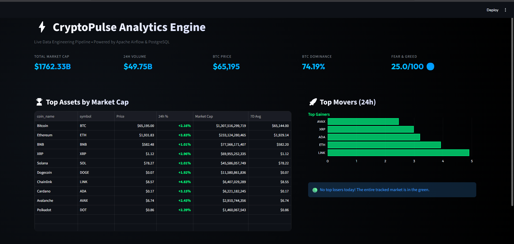
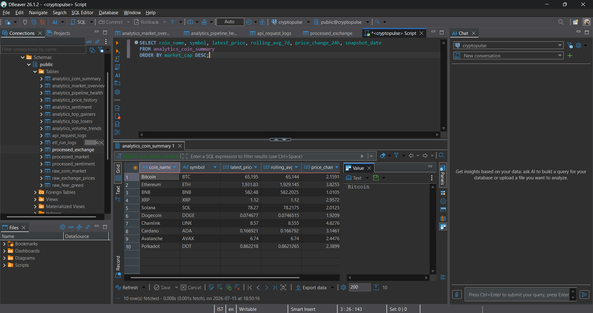

# CryptoPulse 🚀

**Automated Crypto Market Data Pipeline & Analytics Platform**

> End-to-end data engineering project: Python · Apache Airflow · PostgreSQL · Docker · Streamlit

---

## Table of Contents
1. [Project Overview](#project-overview)
2. [Architecture](#architecture)
3. [Features](#features)
4. [Tech Stack](#tech-stack)
5. [Folder Structure](#folder-structure)
6. [Installation & Docker Setup](#installation--docker-setup)
7. [Running the Pipeline Manually](#running-the-pipeline-manually)
8. [Running Airflow](#running-airflow)
9. [Database Schema](#database-schema)
10. [SQL Techniques Demonstrated](#sql-techniques-demonstrated)
11. [Streamlit Dashboard](#streamlit-dashboard)
12. [Testing](#testing)
13. [Logging & Monitoring](#logging--monitoring)
14. [Configuration](#configuration)
15. [Troubleshooting](#troubleshooting)
16. [Future Improvements](#future-improvements)

---

## Project Overview

CryptoPulse is a production-grade data engineering platform that:

- **Collects** cryptocurrency market data from three free public APIs (CoinGecko, Binance, Fear & Greed Index)
- **Validates** all incoming data with schema, business rule, and anomaly checks
- **Transforms** raw data into clean, standardized datasets
- **Stores** data in a layered PostgreSQL architecture (Raw → Processed → Analytics)
- **Orchestrates** the entire pipeline with Apache Airflow on an hourly schedule
- **Serves** analytics-ready datasets to a stunning Streamlit dashboard
- **Monitors** pipeline health, data quality, and API performance

---

## Architecture

```
CoinGecko API  →
Binance API    →  Extract  →  Validate  →  Raw Layer
Fear & Greed   →                               ↓
                                          Transform
                                               ↓
                                       Processed Layer
                                               ↓
                                       Analytics Builder
                                               ↓
                                       Analytics Layer  →  Streamlit Dashboard
                                               ↑
                                        Apache Airflow
```

See [docs/architecture.md](docs/architecture.md) for detailed diagrams.

---

## Features

| Feature | Description |
|---------|-------------|
| **Multi-source ingestion** | CoinGecko, Binance, Fear & Greed Index |
| **Retry & backoff** | Automatic retry on API failures with exponential backoff |
| **Schema validation** | Required columns, data types, field names |
| **Business rule validation** | Negative price/volume/cap rejection |
| **Anomaly detection** | Price spike flagging |
| **Incremental loading** | Only new records inserted (no duplicates) |
| **3-layer architecture** | Raw → Processed → Analytics |
| **Advanced SQL** | CTEs, window functions, rolling averages, RANK, LAG |
| **Airflow orchestration** | 9-task DAG, hourly schedule, retry handling |
| **Data quality checks** | Automated post-load validation queries |
| **Structured logging** | Per-stage execution logs in PostgreSQL |
| **Docker deployment** | Single `docker compose up` setup |
| **Streamlit UI** | Premium glassmorphic analytics dashboard |
| **Unit tests** | Validators, transformers, and loaders tested |

---

## Tech Stack

| Component | Technology |
|-----------|-----------|
| Language | Python 3.11+ |
| Scheduler | Apache Airflow 2.9 |
| Database | PostgreSQL 16 |
| Data Processing | Pandas 2.2 |
| SQL Toolkit | SQLAlchemy 2.0 |
| Dashboard | Streamlit |
| Containers | Docker + Compose |
| Testing | PyTest |

---

## Folder Structure

```
cryptopulse/
├── airflow/
│   ├── dags/
│   │   └── crypto_pipeline.py      # Main Airflow DAG
│   └── logs/                       # Airflow task logs
│
├── config/
│   ├── __init__.py
│   └── settings.py                 # Centralized configuration
│
├── etl/
│   ├── extract/
│   │   ├── coingecko.py            # CoinGecko API client
│   │   ├── binance.py              # Binance API client
│   │   ├── fear_greed.py           # Fear & Greed API client
│   │   └── http_client.py          # Shared HTTP session with retry
│   ├── validate/
│   │   └── validators.py           # Validation engine
│   ├── transform/
│   │   └── transformers.py         # Data transformation functions
│   ├── load/
│   │   └── loaders.py              # Incremental DB loaders + logging
│   ├── analytics_builder.py        # Analytics SQL executor
│   ├── quality_checks.py           # Post-load data quality checks
│   └── pipeline.py                 # Full pipeline orchestrator
│
├── database/
│   ├── schema/
│   │   ├── 01_raw.sql              # Raw layer tables
│   │   ├── 02_processed.sql        # Processed layer tables
│   │   ├── 03_analytics.sql        # Analytics layer tables
│   │   └── 04_logs.sql             # Logging tables
│   ├── views/
│   │   └── views.sql               # SQL views for Power BI
│   └── procedures/
│       └── procedures.sql          # Stored procedures
│
├── dashboard/
│   └── app.py                      # Streamlit interactive dashboard
│
├── docs/
│   └── architecture.md             # Full architecture diagrams
│
├── tests/
│   ├── conftest.py                 # Shared test fixtures
│   ├── test_validators.py          # Validation unit tests
│   ├── test_transformers.py        # Transformation unit tests
│   └── test_loaders.py             # Incremental loading tests
│
├── scripts/
│   ├── init_db.py                  # Standalone DB schema initializer
│   └── init_airflow.py             # Airflow setup helper
│
├── docker/
│   ├── airflow/Dockerfile          # Custom Airflow image
│   └── postgres/init.sh            # Postgres init helper
│
├── requirements.txt
├── docker-compose.yml
├── .env.example                    # Environment variable template
└── README.md
```

---

## Installation & Docker Setup

### Prerequisites
- Docker Desktop 4.x+
- Docker Compose 2.x+
- 4GB RAM minimum

### Quick Start

```bash
# 1. Clone the repository
git clone https://github.com/your-org/cryptopulse.git
cd cryptopulse

# 2. Copy and configure environment variables
cp .env.example .env
# Edit .env if you need custom passwords

# 3. Start all services
docker compose up -d

# 4. Wait ~60 seconds for Airflow to initialize
# Then open Airflow UI:
open http://localhost:8080
# Login: admin / admin123
```

### Service URLs
| Service | URL |
|---------|-----|
| Airflow Webserver | http://localhost:8080 |
| PostgreSQL | localhost:5432 |

---

## Running the Pipeline Manually

```bash
# Run the full ETL pipeline directly (without Airflow)
docker compose exec airflow-scheduler python /opt/airflow/etl/pipeline.py

# Or locally (with correct .env)
python -m etl.pipeline
```

---

## Running Airflow

1. Open http://localhost:8080
2. Login with `admin` / `admin123`
3. Enable the `cryptopulse_pipeline` DAG
4. The DAG runs hourly automatically
5. Trigger manually: **Trigger DAG** button

### DAG Task Order
```
extract_market_data → validate_data → load_raw_tables → transform_data
→ load_processed_tables → build_analytics → run_quality_checks
→ generate_logs → refresh_dashboard
```

---

## Database Schema

### Raw Layer (Immutable)
| Table | Description |
|-------|-------------|
| `raw_coin_market` | CoinGecko market snapshots |
| `raw_exchange_prices` | Binance OHLCV klines |
| `raw_fear_greed` | Fear & Greed index values |

### Processed Layer (Clean)
| Table | Description |
|-------|-------------|
| `processed_market` | Validated, typed coin market data |
| `processed_exchange` | Validated exchange prices |
| `processed_sentiment` | Validated sentiment data |

### Analytics Layer (Reporting)
| Table | Description |
|-------|-------------|
| `analytics_coin_summary` | Daily KPIs per coin (avg, high, low, MA, volatility) |
| `analytics_market_overview` | Daily market totals, BTC/ETH dominance |
| `analytics_top_gainers` | Top 10 daily gainers |
| `analytics_top_losers` | Top 10 daily losers |
| `analytics_volume_trends` | Daily + 7-day rolling volume |
| `analytics_price_history` | OHLCV + MA-7 + MA-30 per coin/day |
| `analytics_sentiment` | Daily Fear & Greed averages |
| `analytics_pipeline_health` | ETL health metrics |

### Logging Layer
| Table | Description |
|-------|-------------|
| `etl_run_logs` | Per-stage execution logs |
| `api_request_logs` | API call durations and status |

---

## SQL Techniques Demonstrated

- **CTEs** – All analytics builders use multi-step CTEs
- **ROW_NUMBER()** – Latest-per-coin deduplication
- **RANK() / DENSE_RANK()** – Top gainers/losers and volume ranking
- **LAG()** – Volume change %, BTC daily change calculation
- **AVG() OVER() with ROWS BETWEEN** – Rolling 7-day and 30-day moving averages
- **STDDEV() OVER()** – Volatility calculation
- **FIRST_VALUE() / LAST_VALUE()** – Open/close price derivation
- **ON CONFLICT DO UPDATE** – UPSERT into analytics tables
- **Incremental INSERT** – Key-based deduplication before insert
- **Indexes** – On coin_id, snapshot_time, source columns
- **CHECK constraints** – price ≥ 0, index 0–100

---

## Streamlit Dashboard

A premium, interactive, dark-themed dashboard is included to visualize the Airflow pipeline results.



**How to run it:**
1. Install requirements: `pip install streamlit pandas sqlalchemy plotly`
2. Run the app: `streamlit run dashboard/app.py`
3. View it in your browser at `http://localhost:8501`

---

## Data Verification (DBeaver)

You can easily query your loaded data using DBeaver or any PostgreSQL client:



---

## Airflow Orchestration

The 9-step ETL pipeline is orchestrated by Apache Airflow:


---

## Testing

```bash
# Install test dependencies
pip install -r requirements.txt

# Run all tests
pytest tests/ -v

# Run with coverage
pytest tests/ -v --tb=short
```

Tests cover:
- **Validators**: Schema check, business rules, edge cases
- **Transformers**: Type coercion, UTC normalization, null handling
- **Loaders**: Incremental logic, duplicate skipping, partial inserts

---

## Logging & Monitoring

All pipeline stages log to:

1. **Python logs** – stdout/stderr via `logging` module
2. **`etl_run_logs`** – Per-stage: rows processed/rejected, execution time, status
3. **`api_request_logs`** – Per-API-call duration and success/failure

Query pipeline health:
```sql
SELECT * FROM vw_pipeline_health;
SELECT * FROM vw_api_performance;
SELECT * FROM analytics_pipeline_health ORDER BY snapshot_date DESC LIMIT 7;
```

---

## Configuration

All configuration is via environment variables (`.env` file):

| Variable | Description | Default |
|----------|-------------|---------|
| `POSTGRES_HOST` | PostgreSQL host | `postgres` |
| `POSTGRES_PORT` | PostgreSQL port | `5432` |
| `POSTGRES_DB` | Database name | `cryptopulse` |
| `POSTGRES_USER` | DB username | `cryptopulse` |
| `POSTGRES_PASSWORD` | DB password | _(required)_ |
| `COINGECKO_BASE_URL` | CoinGecko API URL | _(public default)_ |
| `BINANCE_BASE_URL` | Binance API URL | _(public default)_ |
| `FEAR_GREED_BASE_URL` | Fear & Greed API URL | _(public default)_ |
| `API_TIMEOUT` | API request timeout (s) | `30` |
| `API_MAX_RETRIES` | Max retry attempts | `3` |
| `LOG_LEVEL` | Logging level | `INFO` |
| `PRICE_SPIKE_THRESHOLD` | Price anomaly threshold (fraction) | `0.5` |

---

## Troubleshooting

### PostgreSQL won't start
```bash
docker compose logs postgres
docker compose down -v && docker compose up -d  # reset volumes
```

### Airflow DAG not appearing
```bash
docker compose logs airflow-scheduler
# Ensure dags/ is volume-mounted correctly
```

### API rate limiting (429 errors)
- CoinGecko free tier: 10-30 requests/minute
- The retry adapter handles 429s automatically with backoff
- Reduce `coins` list in `config/settings.py` if needed

### Schema already exists errors
```bash
# The schema uses CREATE IF NOT EXISTS – safe to re-run
python scripts/init_db.py
```

### Import errors in tests
```bash
# Ensure you're running from the project root
cd cryptopulse
PYTHONPATH=. pytest tests/ -v
```

---

## Future Improvements

| Enhancement | Description |
|-------------|-------------|
| Kafka streaming | Real-time data ingestion |
| Redis caching | Cache API responses to reduce calls |
| dbt transformations | Replace SQL strings with dbt models |
| ML price forecasting | ARIMA/LSTM price prediction |
| Alert system | Slack/email on pipeline failure |
| Kubernetes deployment | Scale Airflow workers |
| Additional exchanges | Kraken, Coinbase Pro |
| Data lake | S3/GCS raw data archive |
| CI/CD pipeline | GitHub Actions for test + deploy |
| Real-time UI | Hosted Streamlit Cloud integration |

---

## License

MIT License – see LICENSE file.

---

*Built with ❤️ as a production-grade data engineering portfolio project.*
